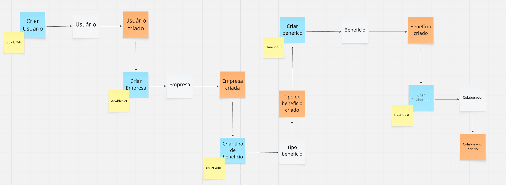

# Gestor de Benefícios Corporativos (Em construção)

Backend de um sistema de gestão de benefícios empresariais, construído com Java (Spring Boot).

## Tecnologias
- Java 17
- Spring Boot
- JWT Authentication
- MySQL

## Funcionalidades
- Cadastro de empresas, colaboradores e benefícios
- Associação de benefícios a colaboradores
- Relatórios por empresa ou colaborador
- Autenticação de usuários (admin e RH)

## Fluxo Inicial:
